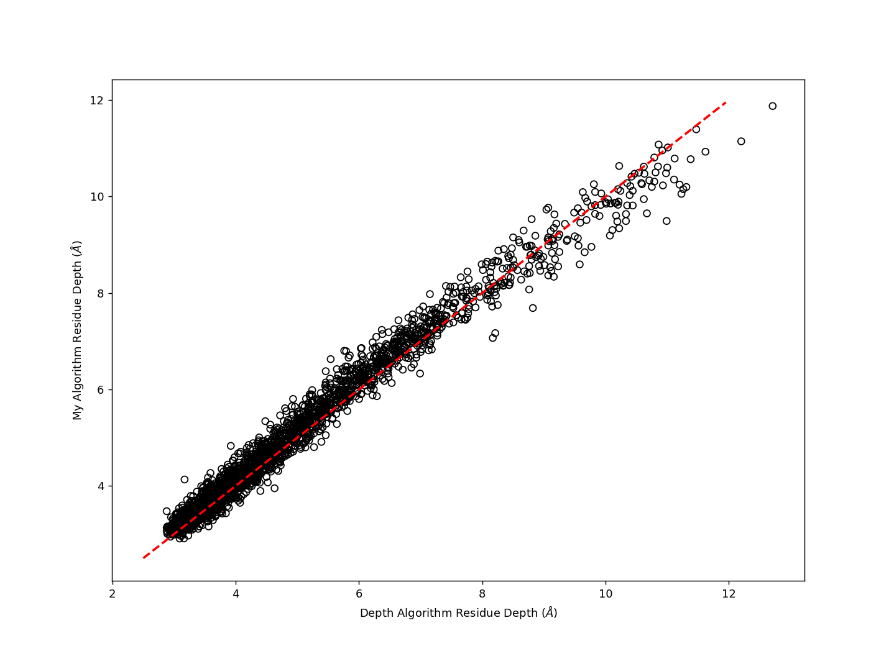

# Residue Depth
## Outline
This is a python implementation of the residue depth algorithm from the Madhusadan lab.

Although the program gives a result very closely related to the original implementation (see plot below) it is much slower.



Further optimisation will be done in the future to improve the speed of the algorithm, these will include trying the numba and cython packages to attempt to speed up distance calculation bottlenecks.

## General usage
```
python res_depth.py -pdb_file PDB
```

## Requirements
Python 3.6
Scipy
Numpy

## Running options
```python
usage: ResidueDepth [-h] -pdb_file PDB_FILE [-ncpus NCPUS]
                    [-iterations ITERATIONS] [-neighbours NEIGHBOURS]
                    [-hydration_shell HYDRATION_SHELL] [-water_box WATER_BOX]
                    [-clash_dist CLASH_DIST] [-prefix PREFIX]
```
A python implementation of the Residue Depth calculation by Tan et al.
```python
optional arguments:
  -h, --help            show this help message and exit
  -pdb_file PDB_FILE    pdb to run residue depth calculation on
  -ncpus NCPUS          Number of cpus to use for calculation (default: number
                        of available cpus will be used)
  -iterations ITERATIONS
                        number of iterations to run (default 25)
  -neighbours NEIGHBOURS
                        number of waters in hydration shell to be considered
                        bulk water (default 2)
  -hydration_shell HYDRATION_SHELL
                        radius of hydration shell (default 4.2)
  -water_box WATER_BOX  specify different water model (default water.pdb)
  -clash_dist CLASH_DIST
                        distance specifying where water clashes with protein
                        atoms (default 2.6)
  -prefix PREFIX        prefix for output files (default pdb file name without
                        .pdb)
```